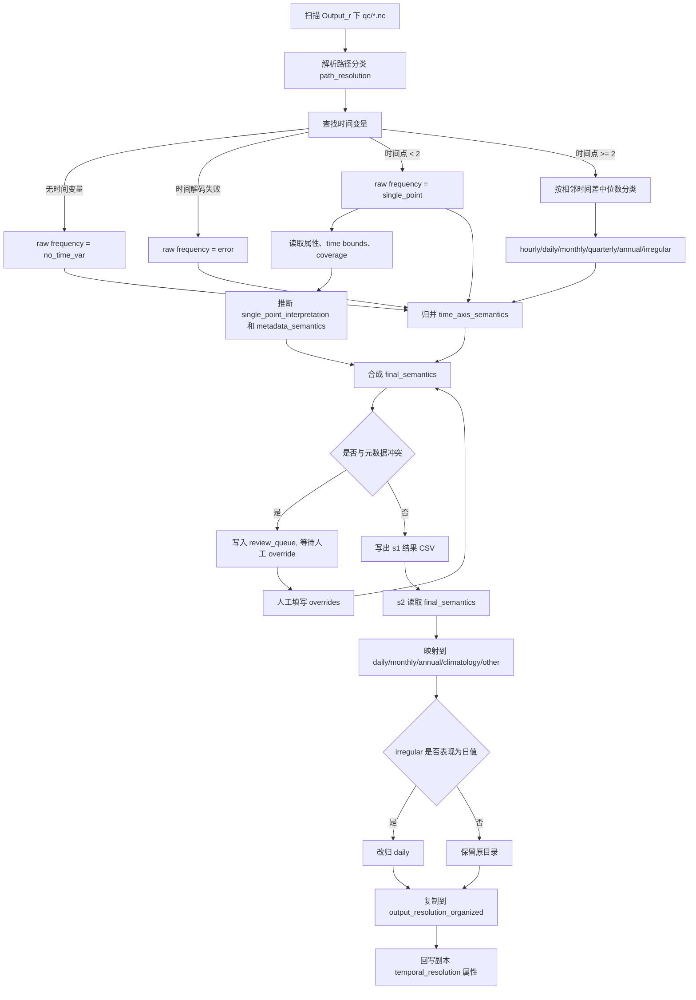

# 时间分辨率判断流程梳理

本文档根据 `s1_verify_time_resolution.py`、`s2_reorganize_qc_by_resolution.py` 以及共享工具 `time_resolution.py` 的当前实现整理。整体流程分两步：

1. `s1_verify_time_resolution.py`：逐个 NetCDF 文件识别时间轴频率，结合元数据和人工 override 得到最终时间语义 `final_semantics`。
2. `s2_reorganize_qc_by_resolution.py`：读取 s1 结果，只处理 `qc` 目录下的文件，将其按时间语义复制到标准输出目录，并回写副本的 `temporal_resolution` 属性。

## 1. 输入范围

### s1 扫描范围

s1 的根目录为脚本所在目录的上一级，即 `Output_r`。

默认扫描满足以下条件的 `.nc` 文件：

- 文件位于 `Output_r` 下；
- 相对路径第 3 级目录名为 `qc`，即形如 `daily/<dataset>/qc/*.nc`、`monthly/<dataset>/qc/*.nc`；
- 不扫描 `scripts_basin_test`、`merged_qc_output`、`output`、`output_resolution_organized` 等输出或脚本目录。

如果传入 `--dataset`，则只保留路径中第 2 级目录名与指定数据集名称匹配的文件。

### s2 处理范围

s2 不重新检测原始时间轴，而是读取 s1 生成的：

`scripts_basin_test/output/s1_verify_time_resolution_results.csv`

然后只处理其中路径包含 `qc` 的文件。

## 2. 路径分类 path_resolution

s1 先根据文件相对 `Output_r` 的第一级目录得到路径分类：

| 第一级目录 | `path_resolution` |
|---|---|
| `daily` | `daily` |
| `monthly` | `monthly` |
| 包含 `annually` 或 `climatology` | `annually_climatology` |
| 其他目录名 | 原目录名 |
| 无法解析 | `None` |

路径分类只用于一致性检查，不直接决定最终时间语义。

## 3. 时间轴频率检测 raw_detected_frequency

s1 打开每个 `.nc` 文件，按以下候选名查找时间变量：

`time`、`Time`、`t`、`datetime`、`date`、`sample`

判断规则如下：

| 情况 | `raw_detected_frequency` / `detected_frequency` |
|---|---|
| 找不到时间变量 | `no_time_var` |
| 时间解码失败 | `error: ...` |
| 时间点数量小于 2 | `single_point` |
| 时间点数量不少于 2 | 根据相邻时间差中位数判断 |

相邻时间差以小时为单位，阈值来自 `time_resolution.classify_frequency`：

| median_diff | 频率 |
|---|---|
| `< 2` 小时 | `hourly` |
| `< 36` 小时 | `daily` |
| `< 24 * 45` 小时 | `monthly` |
| `< 24 * 120` 小时 | `quarterly` |
| `< 24 * 500` 小时 | `annual` |
| 其他 | `irregular` |

注意：当前实现主要使用“相邻时间差中位数”分类，并没有额外检查所有间隔是否高度一致。因此 `irregular` 主要对应中位间隔超过约 500 天，或时间解码/数据形态导致无法归入前述阈值的情况。

## 4. single_point 的元数据解释

当时间轴只有 1 个时间点时，s1 不直接认定业务分辨率，而是继续收集证据：

- 全局属性 `ds.attrs`；
- 时间变量属性；
- 时间变量 `bounds` 指向的边界变量；
- `time_coverage_start` / `time_coverage_end` 等覆盖期属性。

重点读取的属性包括：

- `temporal_resolution`、`Temporal_Resolution`、`time_resolution`、`resolution`；
- `temporal_span`、`Temporal_Span`、`measurement_period`；
- `time_coverage_start`、`data_period_start`、`start_date`；
- `time_coverage_end`、`data_period_end`、`end_date`。

single point 的解释逻辑如下：

1. 若声明的 `temporal_resolution` 为 `daily`，且单个时间点落在 `temporal_span` / `time_coverage` 范围内，同时该范围不超过 36 小时，则元数据语义可认为是 `daily`。
2. 若声明的 `temporal_resolution` 为 `climatology` / `climatological`，且单个时间点与时间覆盖范围相符，或覆盖范围里能解析出年份范围，则元数据语义可认为是 `climatology`。
3. 若属性文本中同时出现多年范围和气候态/平均含义关键词，则解释为长期平均：
   - 年份范围示例：`1970-2021`、`2001-2020`；
   - 关键词包括 `climatology`、`climatological`、`average`、`mean`、`long-term`、`long term`、`historical`；
   - `single_point_interpretation` 形如 `long_term_average_1970_2021`。
4. 若只有气候态/平均关键词，没有明确年份范围，则解释为：
   - `single_point_likely_climatology_year_YYYY`。
5. 若只有年份范围，也解释为长期平均：
   - `long_term_average_YYYY_YYYY`。
6. 否则保留为普通单点时间：
   - `single_point_time_<具体时间>`。

## 5. 时间轴语义 time_axis_semantics

s1 将原始频率先归并为时间轴语义：

| 原始频率 | `time_axis_semantics` |
|---|---|
| `hourly`、`daily` | `daily` |
| `monthly`、`quarterly` | `monthly` |
| `annual` | `annual` |
| `single_point` | `single_point` |
| `irregular` | `irregular` |
| `no_time_var` | `no_time_var` |
| `error: ...` | `error` |
| 其他 | `other` |

这里的含义是：小时数据在后续业务处理中并入日尺度；季度数据并入月尺度。

## 6. 元数据语义 metadata_semantics

s1 再从属性和 single point 解释中推断 `metadata_semantics`：

1. 优先读取声明的 `temporal_resolution`，并标准化为 `daily`、`monthly`、`annual`、`climatology` 等。
2. 对 single point，会结合 `temporal_span` / `time_coverage` 检查声明是否可信。
3. 若 `single_point_interpretation` 以 `long_term_average_` 或 `single_point_likely_climatology_year_` 开头，则认为元数据语义是 `climatology`。
4. 若属性文本中出现 `climatology`、`climatological`、`long-term`、`long term`、`historical`，也认为是 `climatology`。
5. 若属性文本中出现 `average` / `mean`，且同时能解析出年份范围，也认为是 `climatology`。
6. 若没有可靠证据，则 `metadata_semantics` 为空。

## 7. 合成最终语义 final_semantics

s1 的最终结论是 `final_semantics`，同时写入兼容列 `temporal_semantics`。决策顺序如下：

1. 如果人工 override 文件中存在该 `rel_path` 的记录，则直接采用 override：
   - override 文件：`scripts_basin_test/output/s1_resolution_review_overrides.csv`；
   - 合法值：`daily`、`monthly`、`annual`、`climatology`、`irregular`、`other`；
   - `classification_basis = manual_override`；
   - 不再要求人工审核。

2. 如果 `time_axis_semantics` 是 `daily`、`monthly`、`annual`：
   - 若 `metadata_semantics` 为空或与时间轴一致，则采用时间轴语义；
   - 若二者冲突，则仍暂用时间轴语义，但标记：
     - `classification_basis = time_axis_conflict_pending_review`；
     - `review_required = True`；
     - s1 会把该记录写入人工审核队列，并以非 0 状态退出。

3. 如果 `time_axis_semantics = single_point`：
   - 若 `metadata_semantics = climatology`，则 `final_semantics = climatology`；
   - 否则保留 `final_semantics = single_point`，留到 s2 作为 daily 副本处理。

4. 如果 `time_axis_semantics` 是 `irregular`、`no_time_var`、`error`：
   - 直接采用该值。

5. 如果时间轴无法给出有效结论，但 `metadata_semantics` 属于合法语义：
   - 采用 `metadata_semantics`；
   - `classification_basis = metadata_hint`。

6. 其他情况：
   - `final_semantics = other`。

## 8. 与路径分类的一致性检查

s1 会用 `final_semantics` 与 `path_resolution` 做一致性检查，结果写入 `consistent`：

| `path_resolution` | 允许的 `final_semantics` |
|---|---|
| `daily` | `daily` |
| `monthly` | `monthly` |
| `annually_climatology` | `annual`、`climatology` |

以下情况判为不一致：

- `final_semantics` 为 `error`、`no_time_var`、`single_point`、`irregular`、空值；
- 兼容旧字段时，若待比较值以 `error:` 开头，也视为不一致；
- 路径分类与最终语义不在允许映射中。

其他无法识别的路径分类不阻断流程，默认 `consistent = True`。

注意：脚本开头注释里曾写到 `annually_climatology` 可接受 `quarterly`，但当前实际代码以 `final_semantics` 判断，`quarterly` 已先归并为 `monthly`，因此不会被 `annually_climatology` 视为一致。应以当前代码实现为准。

## 9. 人工审核机制

当时间轴语义与元数据语义冲突时，s1 会写出人工审核队列：

`scripts_basin_test/output/s1_resolution_review_queue.csv`

此时 s1 会退出，提示需要人工处理。人工处理方式是把结论写入：

`scripts_basin_test/output/s1_resolution_review_overrides.csv`

override 文件至少包含：

| 列名 | 含义 |
|---|---|
| `rel_path` | 相对 `Output_r` 的文件路径 |
| `resolved_semantics` | 人工确认后的语义 |
| `review_note` | 审核说明 |

s2 启动前会检查审核队列；如果仍存在 `review_required = True` 的记录，s2 会直接阻断，要求先完成 override。

## 10. s2 的目录映射

s2 优先读取 s1 输出中的 `final_semantics`。如果没有该列，则退回使用 `temporal_semantics`；再没有则使用 `detected_frequency`。

映射到输出目录 `resolution_dir` 的规则如下：

| 输入语义 | s2 输出目录 |
|---|---|
| `hourly` | `daily` |
| `single_point` | `daily` |
| `quarterly` | `monthly` |
| `daily` | `daily` |
| `monthly` | `monthly` |
| `annual` | `annual` |
| `climatology` | `climatology` |
| 其他 | `other` |

标准输出目录来自 `pipeline_paths.RESOLUTION_DIRS`：

- `daily`
- `monthly`
- `annual`
- `climatology`
- `other`

默认输出根目录为：

`../output_resolution_organized`

即与 `Output_r` 并列的 `output_resolution_organized`。

## 11. irregular 的二次判定

s2 对 `final_semantics` / `temporal_semantics` / `detected_frequency` 为 `irregular` 的文件做一次额外检查：

1. 重新打开 NetCDF；
2. 读取时间变量；
3. 如果所有有效时间都在当天 `00:00:00`，则认为它表现为离散日值记录；
4. 将 `resolution_dir` 从 `other` 改为 `daily`。

这一步只改变 s2 的副本归档目录，不改变 s1 的原始判断结果。

## 12. s2 文件复制与属性回写

s2 复制文件时会生成全库唯一文件名：

`{source}_{resolution_dir}_{原文件名无后缀}.nc`

如果重名，则追加 `_2`、`_3` 等后缀。

复制完成后，s2 会对副本回写标准属性：

- 仅对 `daily`、`monthly`、`annual`、`climatology` 这四类标准目录回写；
- `other` 不回写为业务时间分辨率；
- 总是维护全局属性 `temporal_resolution`；
- 旧属性键 `Temporal_Resolution`、`time_resolution`、`resolution` 仅在原本存在时同步更新；
- 若属性发生变化，会向 `history` 追加说明。

## 13. 输出文件

s1 输出：

| 输出 | 说明 |
|---|---|
| `scripts_basin_test/output/s1_verify_time_resolution_results.csv` | 全量时间分辨率判断结果 |
| `scripts_basin_test/output/s1_resolution_review_queue.csv` | 需要人工审核的冲突记录 |
| `scripts_basin_test/output/s1_resolution_review_overrides.csv` | 人工审核结论输入文件 |

s2 输出：

| 输出 | 说明 |
|---|---|
| `../output_resolution_organized/daily/` | 日尺度或并入日尺度的副本 |
| `../output_resolution_organized/monthly/` | 月尺度或并入月尺度的副本 |
| `../output_resolution_organized/annual/` | 年尺度副本 |
| `../output_resolution_organized/climatology/` | 气候态/多年平均副本 |
| `../output_resolution_organized/other/` | 无法稳定归类的副本 |
| `scripts_basin_test/output/s2_other_resolution_summary.csv` | other 分类汇总 |
| `scripts_basin_test/output/s2_other_resolution_details.csv` | other 分类明细 |

## 14. 总体流程图

## 15. 快速判读口径

实际使用时可以按以下优先级理解：

1. 多时间点文件优先相信时间轴间隔。
2. single point 文件必须看元数据，尤其是 `temporal_resolution`、`temporal_span`、`time_coverage_start/end`、`bounds` 和是否存在长期平均关键词。
3. 时间轴与元数据冲突时，不自动相信元数据，而是进入人工审核。
4. s1 的可信最终字段是 `final_semantics`，`temporal_semantics` 是兼容别名。
5. s2 的目录只是整理副本：`hourly` 并入 `daily`，`quarterly` 并入 `monthly`，普通 `single_point` 也放入 `daily`，无法稳定解释的进入 `other`。
